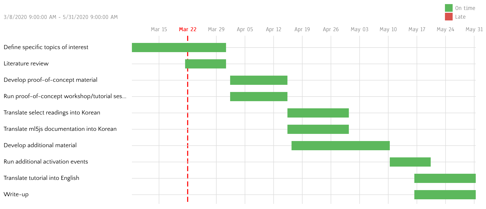

# Critical Machine Learning with ml5.js

This repository contains development documents for:

- A series of educational materials for a critical understanding and usage of machine learning and AI, using ml5.js as central tool; and
- The activation of said materials in South Korea's local context by workshops and/or other public events, held virtually or IRL.

The project is closely tied with another project by Achim called [*Latent Space* 잠재공간](http://jjgg.info), which involves an email newsletter and other community activities. It is also an update to Achim's 2017 project, [Critical Machine Learning](http://criticalml.net/), an online readings list for an interdisciplinary approach to machine learning and AI, curated by subthemes like black box and bias.

The project is partly a response to industry- and government-driven AI initiatives, which typically cast AI as only a vocational skill, as previous coding education initiatives tended to do with software programming. Ultimately, this work intends to use p5.js and ml5 in order to build resources that help people think critically about technology, power, and knowledge. I believe that critical thinking is an integral part of any practice that operates between art and technology, and this project makes that belief explicit.

One goal of the project is to leverage interactive visualization capabilities of p5.js and ease of implementation provided by ml5.js in order to provide an easier entry to machine learning techniques and connect them to their social contexts.

Another goal is to activate and test the developed materials through IRL workshops or virtual sessions. The workshops will be free and enrollment will give priority to marginalized people in South Korean tech context; they will be preferrably accompanied by a talk/discussion event on critical thinking around software, ML and AI. The recent COVID-19 crisis is pushing me to think more towards virtual sessions.

## Development Schedule

### March 8
- Check-in #1 with mentor, Joey Lee

TODO: document and link to meeting notes

### March 18
- Group chat with most ml5js fellows, mentors, and staff
- Check-in #2 with Joey

TODO: document and link to meeting notes

## Links

- For the moment, all links and resources are dumped here: https://www.are.na/achim-koh/cml-ml5js-braindump
- The Processing Foundation's Medium page: https://medium.com/processing-foundation
- ml5.js: https://ml5js.org/
- ml5.js on Medium: https://medium.com/@ml5js
- Achim's website: https://scalarvectortensor.net/
- Achim's newsletter, Latent Space 잠재공간: http://jjgg.info/